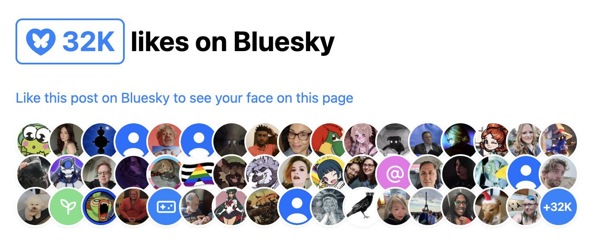

#  BlueSky Likes Components

Components to display (and encourage) likes on [BlueSky](https://bsky.app) posts.

- [`<bluesky-likes>`](#bluesky-likes): Displays the number of likes on a post.
- [`<bluesky-likers>`](#bluesky-likers): Displays avatars of users who liked a post.

For a demo, check out https://projects.verou.me/bluesky-likes/

Can be used separately, or together.

E.g. for something similar to [Salma Alam-Nayor’s](https://whitep4nth3r.com/blog/show-bluesky-likes-on-blog-posts/):

```html
<h2>
	<bluesky-likes src="https://bsky.app/profile/lea.verou.me/post/3lhygzakuic2n"></bluesky-likes>
	likes on Bluesky
</h2>

<p>
	<a href="https://bsky.app/profile/lea.verou.me/post/3lhygzakuic2n">Like this post on Bluesky to see your face on this page</a>
</p>

<bluesky-likers src="https://bsky.app/profile/lea.verou.me/post/3lhygzakuic2n"></bluesky-likers>
```



## Features

These components are designed to make common cases easy, and complex cases possible.

- **Dynamic**: Components respond to changes in the URL of the post — or when it’s lazily set later
- **Aggressive caching**: API calls are cached even across component instances, so you can have multiple components about the same post without making duplicate requests.
- **Ultra-lightweight**: The whole package is [~2 KB minified & gzipped](https://bundlephobia.com/package/bluesky-likes) and dependency-free
- [**Accessible**](#accessibility-notes) & [**i18n** friendly](#i18n-notes)
- **Autoloading** is available to take the hassle out of figuring out when to load the components
- **Highly customizable styling** via regular CSS properties, custom properties, states, and parts (but also beautiful by default so you don’t have to).
- **Customizable content** via slots
- **Hackable**: You can [replace the templates and styles](#replacing-templates-and-styles) of the components with your own, or even subclass them to create new components with different templates and styles

## Installation

The easiest way is to use the [autoloader](#autoloader) and a CDN such as [unpkg](https://unpkg.com/).
All it takes is pasting this into your HTML and you’re ready to use the components:

```html
<script src="https://unpkg.com/bluesky-likes/autoload" type="module"></script>
```

Or, if you know which ones you need, you can import them individually:

```html
<script src="https://unpkg.com/bluesky-likes/likes" type="module"></script>
<script src="https://unpkg.com/bluesky-likes/likers" type="module"></script>
```

You can also install the components via npm and use with your toolchain of choice:

```bash
npm install bluesky-likes
```

Then import the components in your JavaScript.
You can import everything:

```js
import { BlueskyLikes, BlueskyLikers, bsky } from "bluesky-likes";
```

Or you can use individual exports like `bluesky-likes/likes`.

## `<bluesky-likes>`

Displays the number of likes on a post and links to the full list.

```html
<bluesky-likes src="https://bsky.app/profile/lea.verou.me/post/3lhygzakuic2n"></bluesky-likes>
```

To link to a different URL (e.g. the post itself), simply wrap the component in a link:

```html
<a href="https://bsky.app/profile/lea.verou.me/post/3lhygzakuic2n">
	<bluesky-likes src="https://bsky.app/profile/lea.verou.me/post/3lhygzakuic2n"></bluesky-likes>
</a>
```

### Attributes

| Attribute | Type     | Description                               |
| --------- | -------- | ----------------------------------------- |
| `src`     | `string` | The URL of the post to display likes for. |

### Slots

| Name        | Description                    |
| ----------- | ------------------------------ |
| _(Default)_ | Content added after the count. |
| `prefix`    | Custom icon                    |

### Styling

#### Custom properties

None!
Pretty much all styling is on the host element, so you can just override regular CSS properties such as `border`, `padding` or `color` to restyle the component.

#### [Parts](https://developer.mozilla.org/en-US/docs/Web/CSS/::part)

| Name    | Description                                                                     |
| ------- | ------------------------------------------------------------------------------- |
| `link`  | The `<a>` element that links to all likes.                                      |
| `count` | The `<span>` that contains the like count.                                      |
| `icon`  | The default icon which is displayed if nothing is slotted in the `prefix` slot. |

#### [States](https://developer.mozilla.org/en-US/docs/Web/CSS/:state)

| Name      | Description                                             |
| --------- | ------------------------------------------------------- |
| `loading` | Indicates that the component is currently loading data. |

## `<bluesky-likers>`

Displays the avatars of users who liked a post up to a max limit, and the number of additional users not shown.

```html
<bluesky-likers src="https://bsky.app/profile/lea.verou.me/post/3lhygzakuic2n"></bluesky-likers>
```

### Attributes

| Attribute | Type     | Description                                               |
| --------- | -------- | --------------------------------------------------------- |
| `src`     | `string` | The URL of the post to display likes for.                 |
| `max`     | `number` | The maximum number of avatars to display. Defaults to 50. |

### Slots

| Name          | Description                                                                                       |
| ------------- | ------------------------------------------------------------------------------------------------- |
| _(Default)_   | Same as `description`, with lower precedence.                                                     |
| `empty`       | Content displayed when there are no likers.                                                       |
| `skip`        | Content for the skip link. See [Accessibility Notes](#accessibility-notes).                       |
| `description` | Visually hidden content for screen reader users. See [Accessibility Notes](#accessibility-notes). |

### Styling

#### Recipes

- Apply `text-wrap: balance` to the component to equalize the width of the rows.

#### [States](https://developer.mozilla.org/en-US/docs/Web/CSS/:state)

| Name      | Description                                                                                                                                                           |
| --------- | --------------------------------------------------------------------------------------------------------------------------------------------------------------------- |
| `loading` | Indicates that the component is currently loading data. Note that the state will be removed when data loads and the component is updated, not after all avatars load. |
| `empty`   | Indicates that there are no likers to display.                                                                                                                        |

#### Custom properties

| Name                            | Default Value                                                    | Description                                                                          |
| ------------------------------- | ---------------------------------------------------------------- | ------------------------------------------------------------------------------------ |
| `--avatar-size`                 | `calc(2em + 1vw)`                                                | The size of each avatar.                                                             |
| `--avatar-overlap-percentage`   | `0.3`                                                            | The percentage of horizontal overlap between avatars.                                |
| `--avatar-overlap-percentage-y` | `0.2`                                                            | The percentage of vertical overlap between avatars.                                  |
| `--avatar-border`               | `.15em solid canvas`                                             | The border style for each avatar.                                                    |
| `--avatar-shadow`               | `0 .1em .4em -.3em rgb(0 0 0 / 0.4)`                             | The box-shadow applied to each avatar.                                               |
| `--avatar-background`           | `url('data:image/svg+xml,…') center / cover canvas`              | The background for avatars without a user image (default SVG, centered and covered). |
| `--more-background`             | `#1185fe`                                                        | The background color for the "+N" (more) avatar.                                     |
| `--more-color-text`             | `white`                                                          | The text color for the "+N" (more) avatar.                                           |
| `--avatar-overlap`              | `calc(var(--avatar-size) \* var(--avatar-overlap-percentage))`   | The actual horizontal overlap between avatars (as a `<length>`).                     |
| `--avatar-overlap-y`            | `calc(var(--avatar-size) \* var(--avatar-overlap-percentage-y))` | The actual vertical overlap between avatars (as a `<length>`).                       |

### [Parts](https://developer.mozilla.org/en-US/docs/Web/CSS/::part)

| Name           | Description                                                                                                                                                        |
| -------------- | ------------------------------------------------------------------------------------------------------------------------------------------------------------------ |
| `avatar`       | The circular element that displays a user, or the +N for users not shown. Corresponds to an `` element for users with an avatar, and an `<a>` in other cases. |
| `avatar-img`   | The `` element for users with an avatar.                                                                                                                      |
| `link`         | The `<a>` element that wraps each entry (either links to the user's profile, or to all likers)                                                                     |
| `profile-link` | The `<a>` element that links to the user's profile.                                                                                                                |
| `more`         | The `<a>` element that displays the hidden count.                                                                                                                  |
| `skip-link`    | The `<a>` element to skip to the end that is visually hidden but available to keyboard users and screen readers.                                                   |

## Autoloader

Due to its side effects, the autoloader is a separate export:

```js
import "bluesky-likes/autoload";
```

By default, the autoloader will not observe future changes: if the components are not available when the script runs, they will not be fetched.
It will also not discover components that are in shadow roots of other components.
This is done for performance reasons, since these features are slow and these components are mostly used on blogs and other content-focused websites that don’t need this.

If, however, you do, you can use the `observe()` and `discover()` methods the autoloader exports:

- `observe(root)` will observe `root` for changes and load components as they are added. You can use `unobserve()` to stop observing.
- `discover(root)` will discover components in `root` and load them if they are not already loaded. `root` can be any DOM node, including documents and shadow roots.

## Replacing templates and styles

For most common cases, slots should be sufficient for customizing the content of the components and regular CSS to for styling them.
However, for more advanced use cases, you can completely gut them and replace their templates and styles with your own.

Every component class includes the templates used to render it as a static `templates` property and its CSS styles as a `styles` property.
For example, `BlueskyLikes.templates` is the templates used by the `<bluesky-likes>` component, and `BlueskyLikers.styles` is the styles used by the `<bluesky-likers>` component.
Each template is a function that takes a `data` object and returns a string of HTML, while the styles are a string of CSS.

You can either tweak the templates directly, or you can create a subclass with different values and register it as a new component.
If you make changes after elements have already been initialized, you should call `element.render({useCache: true})` on these elements.

## API wrapper

Since these components had to interface with the BlueSky API, they also implement a tiny wrapper for the relevant parts of it.
While this library is absolutely not intended as a BlueSky API SDK, if you do need these functions, they are in [`src/api.js`](src/api.js) and have their own export too: `bluesky-likes/api`.

The following functions are available:

- `getProfile(handle)`: Fetches a user profile by handle.
- `getPost(url)`: Fetches a post details by URL.
- `getPostLikes(url)`: Fetches the likers for a post by its URL.

Also these, though you probably won’t need them unless you’re making new API calls not covered by these endpoints:

- `parsePostUrl(url)`: Parses a BlueSky post URL and returns the post's handle and URI. **Synchronous**.
- `getDid(handle)`: Get the DID of a user by their handle.
- `getPostUri(url)`: Fetches a post AT URI by its URL.

Unless otherwise mentioned, all functions are async.

## Accessibility Notes

These components are designed with accessibility in mind,
in the sense that they use semantically appropriate HTML elements
and have been tested with screen readers.

However, the accessibility of the end result also depends on how you use them.

### `<bluesky-likes>`

By default, the icon’s alt text is empty, since it is considered presentational.
To change this, you can slot in your own icon with a different alt text.

By default, the link’s title is "View all Bluesky likes".
To localize this, you can wrap the element in another link, with your own title.

### `<bluesky-likers>`

By default, the component includes a description for non-sighted users like "271 users liked this post, 50 shown".
You can customize that content by providing your own content in the default slot.

> [!CAUTION]
> Beware of accidentally slotting blank text nodes in the default slot when slotting other elements, e.g.:
>
> ```html
> <bluesky-likers src="...">
>     <div slot="empty">No likers :(</div>
> </bluesky-likers>
> ```
>
> ^ It may not look like it, but here we’ve also slotted a few blank text nodes to the default slot.
>
> To avoid this, you can use the `description` slot instead.

The component includes links to the profiles of the users who liked the post (with `rel="nofollow"`),
and a skip link to skip to the end of the list.
You can customize the content of the link via the `skip` slot and the styling of the link via the `skip-link` part.

## i18n Notes

- Number formatting uses locale-aware formatting (via `Intl.NumberFormat`) using the element’s inherited language.
- CSS uses logical properties where appropriate, so that the components can be used in right-to-left languages without changes
- Any content that may need to be localized has a way to replace it (e.g. via slots)

## Credits

- [Salma Alam-Nayor](https://whitep4nth3r.com/blog/show-bluesky-likes-on-blog-posts/) for the initial idea
- [Dmitry Sharabin](https://d12n.me) for the [CodePen that sparked this](https://codepen.io/dmitrysharabin/pen/Jodbyqm)

## License

These components are [MIT licensed](LICENSE).
However, if you are using them in a way that helps you profit, there is a **social** (not legal) expectation that you [give back by funding their development](https://github.com/sponsors/LeaVerou).
